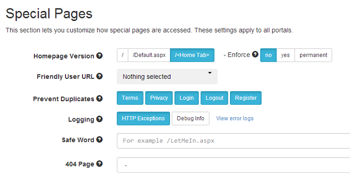

# Logging

URL Adapter comes with 2 levels of logging. One is to log HTTP Exceptions which is useful, for example, to identify broken links or errors happening on your site. The other is to log Debug Information that is useful for troubleshooting.

## Log HTTP Exceptions

URL Adapter can log all HTTP errors such as 404 (Page Not Found) or 500 (Internal Server Error). The logs are saved in `[Portal Home]/Logs/UrlAdapter` (full path showed in the "View logs" page). This option is very useful to see which pages are causing problems at a glance and take action.

The option to turn on logging is located in the Special Pages section from the module.
